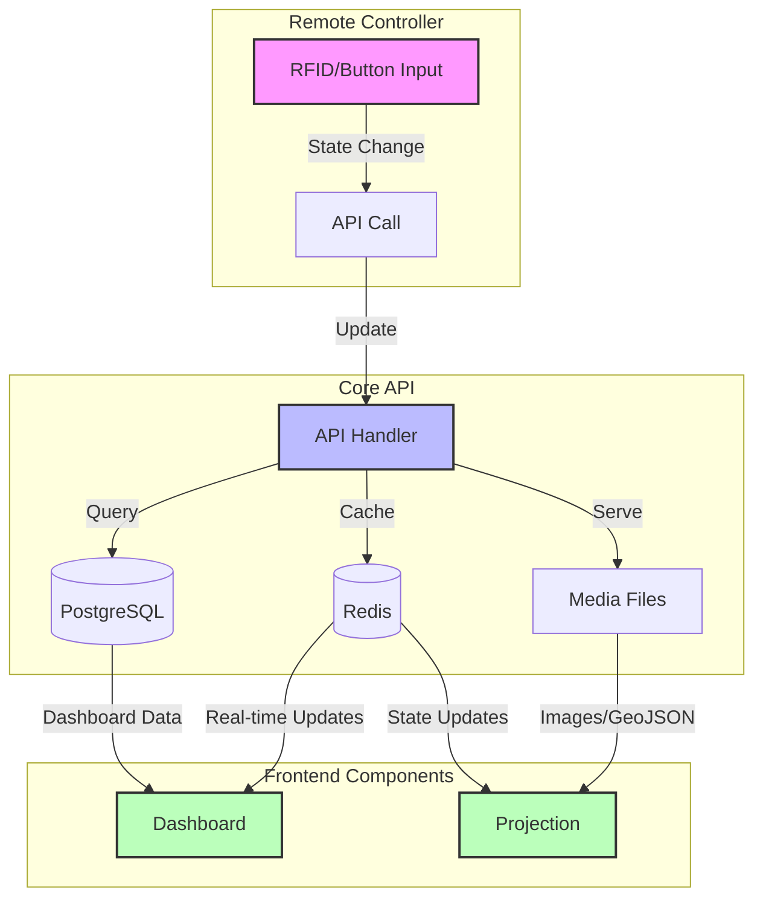
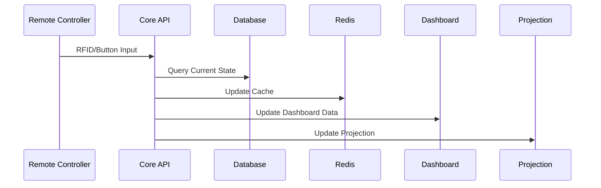
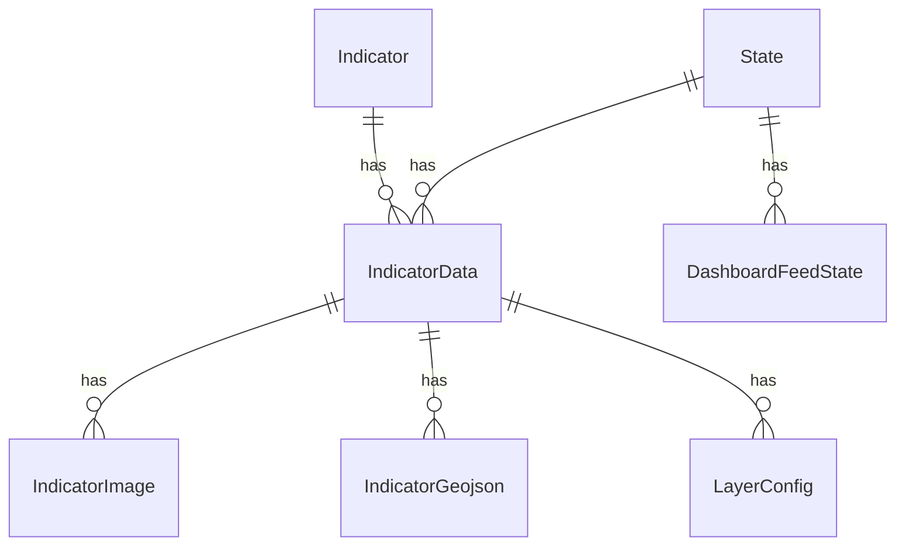

# Data Flow and State Management

## System Overview



## State Management Flow



## Data Models and Relationships



## State Configuration

### RFID Slot Mapping
```json
{
  "13": {"indicator": 1, "state": 0},
  "14": {"indicator": 2, "state": 0},
  "15": {"indicator": 3, "state": 0},
  "16": {"indicator": 4, "state": 0},
  "17": {"indicator": 5, "state": 0},
  "18": {"indicator": 6, "state": 0},
  "19": {"indicator": 7, "state": 0},
  "20": {"indicator": 1, "state": 1},
  "21": {"indicator": 2, "state": 1},
  "22": {"indicator": 3, "state": 1},
  "23": {"indicator": 4, "state": 1},
  "24": {"indicator": 5, "state": 1},
  "25": {"indicator": 6, "state": 1},
  "26": {"indicator": 7, "state": 1}
}
```

### State Values Structure
```json
{
  "year": 2023,
  "scenario": "current",
  "label": "Current State"
}
```

## Data Update Flow

1. **Remote Controller Input**
   - RFID tag read or button press
   - Maps to indicator and state combination
   - Sends update to API

2. **API Processing**
   - Validates input
   - Updates current state in Redis
   - Queries database for new data
   - Serves updated data to frontend

3. **Frontend Updates**
   - Dashboard receives new metrics
   - Projection system updates visualization
   - Real-time updates via Redis

## Minimum Data Requirements

### 1. Basic Indicator Setup
```json
{
  "indicator": {
    "id": 1,
    "name": "Population Density",
    "has_states": true
  },
  "state": {
    "values": {
      "year": 2023,
      "scenario": "current"
    }
  },
  "data": {
    "indicator": 1,
    "state": 1
  }
}
```

### 2. Visualization Data
```json
{
  "image": {
    "path": "indicators/population_density.png",
    "indicatorData": 1
  },
  "geojson": {
    "data": {
      "type": "FeatureCollection",
      "features": [...]
    },
    "indicatorData": 1
  }
}
```

### 3. Dashboard Data
```json
{
  "dashboard": {
    "state": 1,
    "data": {
      "total_population": 1000000,
      "green_space_percentage": 25,
      "average_building_height": 15
    }
  }
}
``` 