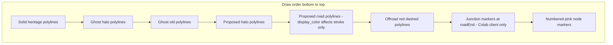

# Agent prompt: Cityscope visual parity with Nur Colab Map pink submissions

**Audience:** AI or human implementers working in **nur-cityscope** (or any consumer) who must draw **curated submission** geometry from **Supabase** so it **matches Nur Colab Map** (`nur-colab-map`) as closely as Cityscope’s own design system allows.

**Primary goal:** Reproduce the **spatial layout** and **layered meaning** of the pink “heritage axis” edit: **unchanged axis (solid)**, **ghosted replaced segments (old)**, **proposed detour / Google-routed alignment (proposed)**, and **off-network connectors**—**without calling Google Routes** or recomputing walking directions in Cityscope.

**Authoritative authoring app:** `nur-colab-map` (React + Leaflet). Treat this document plus that repo as the spec.

---

## 1. Executive summary (read first)

| Layer (Colab meaning) | What user sees | Persisted in Supabase today? | Cityscope implication |
|----------------------|----------------|------------------------------|------------------------|
| **Solid** — unchanged heritage axis | Bright pink polyline(s), full opacity | **No** per submission (comes from **project base** GeoJSON in Colab, not `geo_features` for the submission) | To draw solid, Cityscope needs the **same base heritage geometry** the author saw, **or** accept that only submitted geometry is available. |
| **Removed / “ghosted old”** — heritage segments replaced by a detour | Softer pink, lower opacity, optional white **halo** underneath | **No** | Cannot be reconstructed from submission rows **alone**. Options: (a) extend Colab persistence (recommended for true parity), (b) re-derive removed intervals if Cityscope has base axis + detour points and ports Colab’s interval logic (**not** Google; geometric only), (c) omit ghost layer. |
| **Proposed** — detour polyline (Google on-road + straight legs) | Dashed polyline, stronger weight; stroke color from **submission display color** when set; white **halo** underneath | **Partially:** one merged **`pink_line_route`** `LineString` holds the **full** proposed walk path (road + straight off-network gaps). | Draw this line with **proposed** symbology. **Do not** re-route; use vertices as stored. |
| **Off-network leg** — “no official navigation network here” | **Red dashed** segment from last on-road vertex to user target; RTL tooltip in Colab (not in DB) | **Geometry only:** stored as a **straight two-point segment** inside the same `pink_line_route` sequence (no feature flag) | Cityscope cannot read Colab’s tooltip text from DB. Either hard-code equivalent copy in Cityscope, infer “likely offroad” heuristically, or persist explicit metadata (future Colab work). |
| **Pink nodes** | Numbered markers, fill from display color (when valid) | **Yes** — `pink_line_node` points | Match marker semantics (order / labels per product rules). |

**Critical honesty for implementers:** Full **pixel-semantic parity** (solid vs ghost vs proposed vs offroad) is **not** fully encoded in current `geo_features` rows. What **is** reliably available without Google is the **single merged proposed path** (`pink_line_route`) plus **node points** plus **`submission_batches.display_color`**. Plan Tier A vs Tier B below.

---

## 2. Supabase contract (what to query)

### 2.1 `submission_batches`

- **`submission_id`** (UUID): groups one submission.
- **`submission_name`**: display label.
- **`display_color`**: canonical `#RRGGBB` (uppercase in DB constraint). In Colab, a **palette-valid** value is used for: **proposed** detour stroke (via `routeLineStylesForDisplayColor`), **pink node marker fill**, and an optional **memorial marker** accent shell (see `MapPage` around `pinkNodeFill` / `placeMemorial`). `mapLineStyles` itself only swaps the **proposed polyline** stroke; solid and ghost route colors stay fixed pinks. Always present for new writes (migrations enforce palette + NOT NULL).

**Join key:** All features below share the same `submission_id`.

### 2.2 `geo_features` (pink project only for route semantics)

Filter by the curated **pink line** `project_id` your Cityscope table uses (Colab calls this the “pink project” in workspace context).

| `feature_type` | Geometry | Role |
|----------------|----------|------|
| `pink_line_node` (or legacy `Point` with **`feature_type` null** on the pink project) | `Point` | User detour / ordering stops. `name` / `description` are user text. Coordinates are `[lng, lat]` in GeoJSON (PostGIS stores SRID 4326). |
| `pink_line_route` | `LineString` | **Persisted “final” proposed walking path** after Google Routes was used in Colab at author time. Description in Colab insert: `Computed walking route (Google Routes API)` — informational only. |

**Memorial sites** (`central`, `local` on memorial project) are out of scope for this pink-route doc unless your map bundles them; Colab draws them with separate icons.

### 2.3 Example selection shape (illustrative)

```sql
-- Pseudocode: parameterize pink_project_id, submission_id
select feature_type, name, description, geom
from geo_features
where submission_id = $1
  and project_id = $2
  and feature_type in ('pink_line_node', 'pink_line_route');
```

```sql
select submission_id, submission_name, display_color
from submission_batches
where submission_id = $1;
```

---

## 3. How Colab builds geometry (so you know what’s inside `pink_line_route`)

**You must not re-run Google in Cityscope.** The saved `LineString` is the contract.

### 3.1 Authoring pipeline (high level)

1. **Base heritage paths** are parsed from Colab’s **bundled** default axis asset (`line-layer/heritage-axis.geojson` — see `HERITAGE_AXIS_URL` in `MapPage`), not from a per-submission Supabase row. Runs are split for gaps (`parseDefaultLinePaths` / `normalizeHeritageSegments`, max gap **3500 m**).
2. With **no** user points: proposed persistence uses **solid** heritage only (no detour).
3. With **user points** (pink nodes): Colab computes detour **intervals** on the base polyline: **solid** = untouched portions; **removed** = replaced sub-polylines (ghost layer); **dashed** = logical detour polyline (leave axis → ordered user points → rejoin axis).
4. **Google Routes (Supabase edge function `routes-compute`):** each sub-segment of the dashed polyline is replaced by a **walk route** polyline. After routing, pieces pass through **`mergeDetourPaintNearHeritage`** (can trim/snaps near the heritage axis) before persistence. Where the routed end stays within **~28 m** of the intended detour vertex, the leg is treated as on-road; if farther, Colab inserts an **offroad** piece: straight line from last on-road point to the detour vertex (`OFFICIAL_NETWORK_GAP_METERS = 28`).
5. **Persistence:** `flattenIntegratedRouteForPersistence` walks the final `detourPaint` list: concatenates all **road** polylines, then for each **offroad** piece appends exactly **`[roadEnd, target]`** (two coordinates). Result is **`pink_line_route`**.

**Implication:** `pink_line_route` is a **single** vertex list: on-road detail and straight “off network” connectors are **sequential** with **no** per-vertex type in the database.

**Loader note:** `loadSubmissionBatchMapDetail` only hydrates **Point** geometries into editor state (`pointLatLng`); **`pink_line_route` LineStrings are skipped there** (not an explicit `feature_type` filter). Cityscope consumers should still **read** `pink_line_route` for publication geometry.

---

## 4. Colab symbology — replicate in Cityscope within your design tokens

Reference implementation: `src/pages/MapPage/mapLineStyles.ts` (`routeLineStylesForDisplayColor`) and `src/map/pinkDetourLeaflet.ts`.

### 4.1 When pink nodes exist (`showPinkDetours` in Colab)

Draw order matters (bottom → top in Colab `MapPage`): **solid heritage** polylines first, then **ghost halos → ghost stroke**, then **`addDetourPaintToMap`**: **proposed halos → proposed road dashes → offroad red dashes → junction markers** at each `roadEnd` (junction markers are client-only; not in Supabase).

#### Solid (unchanged heritage)

- **Stroke:** `#FF69B4`, weight `5`, opacity `0.9`, round caps/joins.
- **Not** tinted by `display_color`.

#### Old / ghosted (removed heritage segments)

- **Halo (under):** `#ffffff`, weight `6`, opacity `0.22`, round.
- **Stroke:** `#ff69b4`, weight `4.5`, opacity `0.5`, round.
- **Not** tinted by `display_color`.

#### Proposed (Google on-road pieces in Colab UI)

- **Halo (under):** `#ffffff`, weight `7`, opacity `0.22`, round (solid halo; dash on top).
- **Stroke default:** `#ff587b`, weight `6`, opacity `0.95`, `dashArray: "3 7"`, round.
- **If** `submission_batches.display_color` is a **valid palette** color (see `src/submission/submissionDisplayColor.ts` — 16 hues, must match DB CHECK / Colab allowlist): use that hex for **proposed stroke only**; keep weight, opacity, dash pattern as above.

#### Off-network connector (Colab-only classification)

- Separate Leaflet pane; **not** the pink dash style.
- **Stroke:** `#C62828`, weight `4`, opacity `0.95`, `dashArray: "6 10"`, round caps.
- Hover (Colab): weight `7`, color `#FF5252`, opacity `1` — optional in Cityscope.
- **Tooltip copy (Colab, Hebrew, RTL):** not in DB. If product needs parity, duplicate meaning in Cityscope strings/accessibility.

### 4.2 When there are **no** pink nodes

Colab only draws **solid** heritage polylines (no ghost, no proposed overlay). Persistence still may store a `pink_line_route` following the “no detour” flatten rules.

---

## 5. Tiered implementation targets

### Tier A — “No recalculation” (strict)

**Inputs:** `pink_line_route`, `pink_line_node`, `submission_batches.display_color`.

**Draw:**

- One **proposed-style** polyline (or Cityscope-neutral “submitted path”) from `pink_line_route`.
- Nodes with labels / pins using `display_color` when valid.

**Accept:** No ghost layer, no solid split, offroad not distinguished unless you add heuristics or copy.

### Tier B — “Visual parity with Colab” (no Google)

Pick **one**:

1. **Schema extension in Colab** (preferred for deterministic parity): persist `removed` MultiLineString(s), optional `detour_paint` JSON, optional `solid` snapshot — then Cityscope only renders stored layers.
2. **Cityscope-side geometric replay (no Google):** load the **same** default heritage GeoJSON Colab uses for that workspace, re-run **only** the heritage + interval + flatten logic equivalent to `src/utils/pinkLineRoute.ts` **excluding** `computeRoute`. **Caution:** This diverges from author if Colab’s base axis changes after submission; frozen geometry in DB is safer.

---

## 6. Engineering checklist for the Cityscope agent

- [ ] **Do not** call Google Routes or any walking router for published `pink_line_route`.
- [ ] Parse `LineString` coordinates as **GeoJSON order** `[lng, lat]` in JSON from PostGIS/Supabase clients.
- [ ] Read **`submission_batches.display_color`**: when palette-valid, use it for **proposed detour stroke** (and, if matching Colab UX, **node fill** and **memorial accent**); otherwise use Colab defaults (`#ff69b4` node fill; proposed stroke from `mapLineStyles` defaults).
- [ ] Implement **layer order** and **halo-under-dash** pattern analogous to Colab for proposed paths.
- [ ] Render **`pink_line_node`** (and legacy null-`feature_type` pink `Point`s) with project-appropriate numbering. Colab uses **`optimizeRoute`** (`src/utils/routeOptimizer.ts`): a **greedy insertion heuristic** when `pinkNodes.length > 1`, not an exact TSP solver — port that function if badge order must match Colab exactly.
- [ ] Document product choice for **Tier A vs Tier B** and for **offroad** messaging (no DB source today).
- [ ] If Tier B without schema change: confirm **source of truth** for base heritage axis (versioned asset vs live project geometry).

---

## 7. Optional diagram (layer stack when detours exist)



---

## 8. File pointers in `nur-colab-map` (for deep dives)

| Topic | Path |
|-------|------|
| Route flattening + Google/offroad merge | `src/utils/pinkLineRoute.ts` |
| Leaflet layer order + styles hookup | `src/pages/MapPage/index.tsx` (search `integratedPinkRoute`, `addDetourPaintToMap`) |
| Stroke tokens + display color rules | `src/pages/MapPage/mapLineStyles.ts` |
| Offroad line + tooltip | `src/map/pinkDetourLeaflet.ts` |
| Supabase write of route line | `src/supabase/unifiedSubmission.ts` (`insertPinkRouteLineIfNeeded`) |
| Display color palette | `src/submission/submissionDisplayColor.ts` + migrations `supabase/migrations/20260418120000_submission_display_color_palette_v2.sql` |

---

## 9. Suggested one-line instruction to paste into the Cityscope agent chat

> Implement published-map rendering for each `submission_id` by querying `submission_batches.display_color` and `geo_features` (`pink_line_route` LineString + `pink_line_node` / legacy pink `Point`s on the pink project). Draw the LineString **exactly** as stored (no routing APIs). Match **layer order** and **stroke semantics** from `nur-colab-map` (`mapLineStyles.ts`, `pinkDetourLeaflet.ts`, MapPage route layer loop): **solid** under **ghost** under **proposed**; solid and ghost use **fixed** pinks; **proposed detour stroke** uses palette-valid `display_color` (Colab also uses that hex for **node fill** and optional **memorial** shell — mirror if you need full UI parity). Halos sit under dashed strokes. Ghosted “old” segments are **not** in Supabase today—either omit, add a Colab persistence migration, or replay detour intervals against a **frozen** heritage axis without Google. Offroad legs are **straight** segments inside `pink_line_route`; Colab’s Hebrew tooltip is **not** in the DB—replicate in Cityscope UX if required.

---

*Document version: aligned with `nur-colab-map` behavior as of the repository state when this file was authored. If persistence gains new columns, update §1 and §5 Tier B option 1.*
